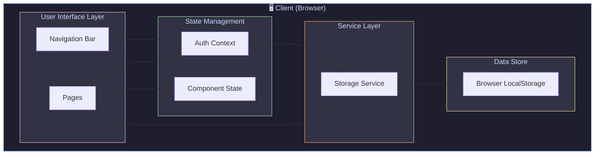
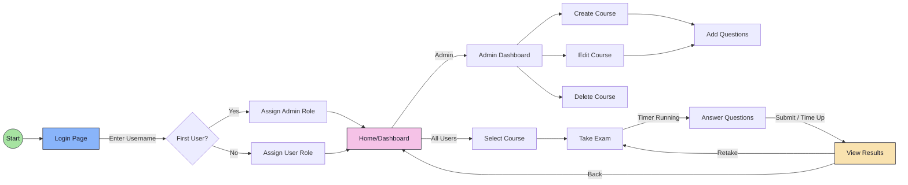
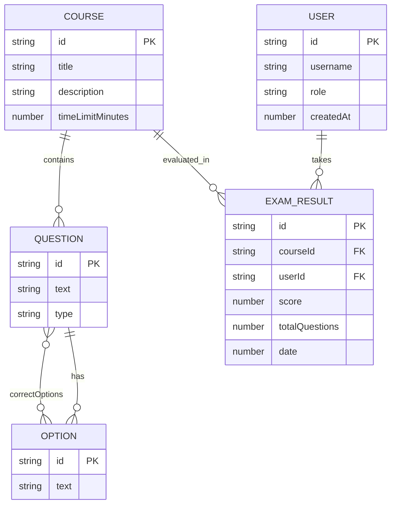

# SkillUpgrade

A modern, feature-rich quiz and examination platform built with Next.js 16 and React 19.

---

## 🚀 Project Features

### 🔐 Authentication & User Management
- **Simple Login System** - Username-based authentication with automatic role assignment
- **Role-Based Access Control** - First registered user becomes admin, subsequent users get standard access
- **Persistent Sessions** - User sessions stored in localStorage for seamless experience
- **Secure Logout** - Clean session termination with proper state cleanup

### 📚 Course Management (Admin)
- **Create Courses** - Admins can create new courses with title, description, and time limits
- **Edit Courses** - Full editing capabilities for existing courses
- **Delete Courses** - Remove courses with confirmation dialog
- **Question Builder** - Add questions with:
  - Markdown support for rich text formatting
  - Single choice (radio) questions
  - Multiple choice (checkbox) questions
  - Multiple options per question
  - Correct answer designation

### 📝 Examination System
- **Timed Exams** - Countdown timer with visual alerts when time is running low
- **Question Navigation** - Easy navigation between questions with progress dots
- **Answer Tracking** - Real-time tracking of answered/unanswered questions
- **Auto-Submit** - Automatic submission when time expires
- **Markdown Rendering** - Questions support full markdown syntax including code blocks

### 📊 Results & Feedback
- **Instant Scoring** - Immediate score calculation upon submission
- **Visual Feedback** - Emoji and color-coded feedback based on performance
- **Audio Feedback** - Sound effects for success/failure outcomes
- **Detailed Stats** - Score percentage, date completed, and status display
- **Retake Option** - Easy access to retake exams for improvement

### 🎨 Modern UI/UX
- **Glassmorphism Design** - Modern glass-card aesthetics throughout
- **Gradient Accents** - Beautiful indigo-purple-pink gradients
- **Responsive Layout** - Fully responsive design for all screen sizes
- **Smooth Animations** - Subtle animations and transitions for polished feel
- **Loading States** - Spinner indicators for async operations

---

## 🛠️ Technology Stack

| Category | Technology |
|----------|------------|
| **Framework** | Next.js 16.0.10 |
| **UI Library** | React 19.2.1 |
| **Language** | TypeScript 5 |
| **Styling** | Tailwind CSS 4 |
| **Markdown** | react-markdown 10.1.0 |
| **Storage** | Browser LocalStorage |

---

## 📁 Project Structure

```
skillupgrade/
├── app/
│   ├── admin/            # Admin dashboard & course management
│   │   ├── page.tsx      # Admin dashboard
│   │   └── course/       # Course editor
│   ├── components/       # Reusable UI components
│   │   └── Navbar.tsx    # Navigation bar
│   ├── context/          # React contexts
│   │   └── AuthContext.tsx  # Authentication provider
│   ├── exam/             # Exam taking interface
│   │   └── [courseId]/   # Dynamic exam pages
│   ├── login/            # Login page
│   ├── result/           # Exam results page
│   ├── services/         # Business logic
│   │   └── storage.ts    # LocalStorage operations
│   ├── utils/            # Utility functions
│   │   └── audio.ts      # Sound effects
│   ├── types.ts          # TypeScript interfaces
│   ├── globals.css       # Global styles
│   ├── layout.tsx        # Root layout
│   └── page.tsx          # Home page
├── public/               # Static assets
└── package.json          # Dependencies
```

---

## 🏗️ System Architecture Diagram



---

## 🔄 User Flow Diagram



---

## 📦 Data Models



---

## 🚦 Getting Started

```bash
# Install dependencies
npm install

# Run development server
npm run dev

# Build for production
npm run build

# Start production server
npm start
```

---

## 📌 Key Features Summary

| Feature | Description |
|---------|-------------|
| **Authentication** | Simple username-based with role assignment |
| **Course Creation** | Full CRUD operations for admins |
| **Markdown Support** | Rich text in questions with code highlighting |
| **Timed Exams** | Configurable time limits with auto-submit |
| **Instant Results** | Immediate scoring with visual/audio feedback |
| **Progress Tracking** | Visual dots showing answered questions |
| **Responsive Design** | Works on desktop, tablet, and mobile |
| **Persistent Storage** | All data saved in browser localStorage |

---

## 🎯 Future Enhancements

- [ ] Backend API integration for data persistence
- [ ] User progress history and analytics
- [ ] Export results to PDF/CSV
- [ ] Share courses via links
- [ ] Question bank and randomization
- [ ] Leaderboard and achievements
- [ ] Dark/Light theme toggle

---

<div align="center">

**Built with ❤️ using Next.js & React**

</div>
